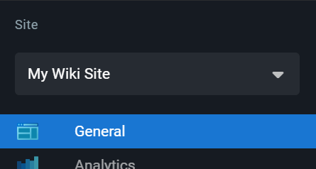

# Overview

Multiple wiki sites can be hosted on the same Wiki.js instance. This allows you to clearly separate content belonging to different teams or products.

The following resources are tied to a site:

- Pages (including history)
- Comments
- Media Assets
- Site Configuration (e.g. theme, locales, navigation, etc.)

> [!IMPORTANT]
> Users reside at the global level and are **NOT** tied to a site. They can be allowed access to multiple sites at once. Use **Group Rules** to restrict a user access to one or more sites.

# Requirements

- Each site requires a **dedicated hostname** (sub-domain or domain). You cannot use subfolders as distinct sites.
- The server cannot listen on multiple network interfaces for different sites. If you have such need, you must either use a reverse proxy (e.g. nginx) to handle traffic from different IPs or launch dedicated instances for each interface.

# Create a Site

Click on the **New Site** button. A dialog to create a new site will appear.

Both values can be changed at any time later from the **General** page.

# Modify a Site

From the left sidebar, select the site you want to edit from the dropdown menu:

Sidebar menu items (e.g. General, Analytics, etc.) under the **Site** section will affect only the currently selected site.

The **General** page is where most of the site settings can be customized.

# Disable a Site

You can disable a site which prevents all non-administrator users from accessing it. This is useful if you need to perform maintenance operations and want to prevent any changes to the site during this timeframe.

From the **Sites** section, click on the **Active** toggle next to the site you want to disable. You'll be prompted to confirm your choice.

To re-enable a site, click on the same toggle again.

# Delete a Site

To delete a site, click the red delete button next to the desired site. You'll be prompted to confirm your choice.

> [!CAUTION]
> This will permanently delete all pages, comments, assets and settings associated to this site!
> Note that users **will** NOT be affected as they are global to the instance and **NOT** tied to a specific site.
