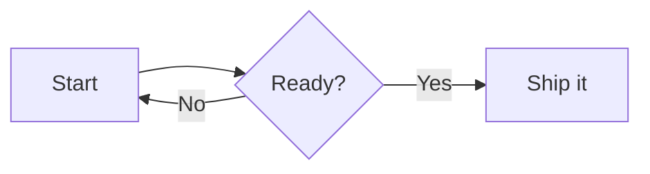

# Description

Draws a Mermaid diagram — flowchart, sequence, class, state, ER, gantt and more.

# Demo

::block-diagram

::

# Parameters

| Parameter | Default Value | Possible / Example Values |
| :-- | :-- | :-- |
| `caption` | `<none>` | `Foo Bar` |
| `theme` | `auto` | `auto`, `default`, `dark`, `neutral` or `forest` |
| `align` | `left` | `left` or `center` |
{.table-leading-col .table-code-nohighlight}

# Body

The body consists of a **Mermaid** code block.

Check out the [Mermaid Syntax Reference](https://mermaid.ai/open-source/intro/syntax-reference.html) for more details.

# Default Code

````md
::block-diagram

::
````

