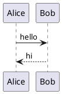

# Description

Draws a PlantUML diagram — sequence, class, state, activity, mindmap, gantt and the rest.

# Demo

::block-plantuml

::

# Parameters

| Parameter | Default Value | Example Value |
| :-- | :-- | :-- |
| `server` | `https://www.plantuml.com/plantuml` | `https://www.plantuml.com/plantuml` |
| `format` | `svg` | `svg` or `png` |
| `caption` | `<none>` | `Some caption` |
| `align` | `left` | `center` or `left` |
{.table-leading-col .table-code-nohighlight}

# Default Code

````md
::block-plantuml

::
````

