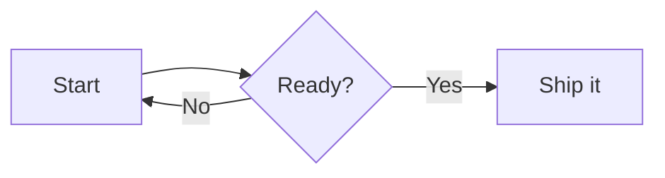

This is the reference for the supported Markdown syntax in Wiki.js.

> [!TIP]
> To learn about the interface of the Markdown editor itself and its features, check out the [Markdown Editor](/guide/editors/markdown) guide instead.

# Basic Syntax

## Admonitions

:::block-tabs
::block-tab{label="Usage"}
Admonitions are blockquotes used for advice. They are styled to grab attention to show a tip, note, important, warning or caution.

Same syntax as [blockquotes](#blockquotes) but the first line is one of:
- `> [!NOTE]`
- `> [!TIP]`
- `> [!IMPORTANT]`
- `> [!WARNING]`
- `> [!CAUTION]`

> [!TIP] Custom Title
> The title can be customized by adding a custom string at the end of the first line, e.g.:
> `> [!NOTE] Custom Title`

**Shortcuts**
- On the desired line, then clicking the <kbd>:mdi:format-quote-close:</kbd> dropdown button in the top toolbar and choosing one of the 5 admonition options.
::

::block-tab{label="Examples"}
The following code:
```markdown
> [!NOTE]  
> Highlights information that users should take into account, even when skimming.

> [!TIP]
> Optional information to help a user be more successful.

> [!IMPORTANT]  
> Crucial information necessary for users to succeed.

> [!WARNING]  
> Critical content demanding immediate user attention due to potential risks.

> [!CAUTION]
> Negative potential consequences of an action.

> [!CAUTION] Some custom title
> Negative potential consequences of an action.
```

becomes:

> [!NOTE]
> Highlights information that users should take into account, even when skimming.

> [!TIP]
> Optional information to help a user be more successful.

> [!IMPORTANT]  
> Crucial information necessary for users to succeed.

> [!WARNING]  
> Critical content demanding immediate user attention due to potential risks.

> [!CAUTION]
> Negative potential consequences of an action.

> [!CAUTION] Some custom title
> Negative potential consequences of an action.
::
:::

## Blockquotes

:::block-tabs
::block-tab{label="Usage"}
Blockquotes are useful for citations and asides.

Using a **greater-than** symbol `>`, followed by a space, before each line of text.

**Shortcuts**
- On the desired line, then clicking the <kbd>:mdi:format-quote-close:</kbd> dropdown button in the top toolbar and choosing **Blockquote**.
::

::block-tab{label="Examples"}
The following code:
```markdown
> Lorem ipsum dolor sit amet
> Consectetur adipiscing elit
```

becomes:

> Lorem ipsum dolor sit amet
> Consectetur adipiscing elit
::

::block-tab{label="Stylings"}

> [!WARNING]
> This is legacy Wiki.js 2.x syntax. While it will keep working for the foreseable future, it's recommended to use the [Admonitions](#admonitions) syntax instead, which is supported by various platforms like GitHub/GitLab.

By adding a class on a separate line, after the blockquote, you can change the look of the blockquote. Note that these stylings are specific to Wiki.js and will fallback to standard blockquote styling in other applications.

- Blue: `is-info`
- Green: `is-success`
- Yellow: `is-warning`
- Red: `is-danger`

```markdown
> Lorem ipsum dolor sit amet
> Consectetur adipiscing elit
{.is-info}
```

> This is a `{.is-info}` blockquote.
{.is-info}

> This is a `{.is-success}` blockquote.
{.is-success}

> This is a `{.is-warning}` blockquote.
{.is-warning}

> This is a `{.is-danger}` blockquote.
{.is-danger}

> This is a default unstyled blockquote.
::
:::

## Bold

:::block-tabs
::block-tab{label="Usage"}
Using **double asterisks** symbols before and after the text selection.

**Shortcuts**
- By selecting text, then clicking the <kbd>:mdi:format-bold:</kbd> button in the top toolbar.
- By selecting text, then pressing <kbd>CTRL</kbd> + <kbd>B</kbd>
::

::block-tab{label="Examples"}
The following code:
```markdown
Lorem **ipsum** dolor
```
becomes:

Lorem **ipsum** dolor
::
:::

## Code Blocks

:::block-tabs
::block-tab{label="Usage"}
Using **triple backticks** symbols before and after the text selection, on dedicated lines.

**Shortcuts**
- By click the <kbd>:mdi:code-json:</kbd> button in the left toolbar.
::

::block-tab{label="Examples"}
The following code:
````
```
function lorem (ipsum) {
	const dolor = 'consectetur adipiscing elit'
}
```
````
becomes:

```
function lorem (ipsum) {
	const dolor = 'consectetur adipiscing elit'
}
```
::
::block-tab{label="Syntax Highlighting"}
By default, a code block is rendered as plain preformatted text. It's however preferable to use syntax highlighting for programming code, allowing for easier readability. To specify the programming language used in the code block, simply add the language keyword right after the opening triple backticks:

````java
```java
// some code here
```
````

Refer to the [reference list](https://github.com/highlightjs/highlight.js/blob/main/SUPPORTED_LANGUAGES.md){target=_blank} of about 185 supported programming languages.
::
:::

## Definition Lists

:::block-tabs
::block-tab{label="Usage"}
On a new line, enter a term.
On a another new line under it, using a **colon** symbol, followed by a space, before each line of text.

> [!TIP]
> A term can have multiple definitions by stacking multiple lines starting with a colon + space.

**Shortcuts**
- By clicking the <kbd>:mdi:format-list-group-plus:</kbd> button in the left toolbar.
::

::block-tab{label="Examples"}
The following code:
```markdown
Term A
: Definition of the term A

Term B
: Definition of the term B
: Another definition of the term B
```
becomes

Term A
: Definition of the term A

Term B
: Definition of the term B
: Another definition of the term B
::
:::

## Headers

:::block-tabs
::block-tab{label="Usage"}
Headers are used to build the table of contents shown optionally on the right.

Using between 1 and 6 **hashtag** symbol(s), followed by a space, before the text selection.

> [!TIP]
> It's recommended to use the page title as what would traditionally be the "Header 1" level in a classic word processor, rather than duplicate the title in the page contents.

**Shortcuts**
- On the desired line, then clicking the <kbd>:mdi:format-header-pound:</kbd> dropdown button in the top toolbar.
- On the desired line, press <kbd>CTRL</kbd> + <kbd>ALT</kbd> +  <kbd>Right</kbd> to increase the header level.
- On the desired line, press <kbd>CTRL</kbd> + <kbd>ALT</kbd> +  <kbd>Left</kbd> to decrease the header level.
::

::block-tab{label="Examples"}
```markdown
# Header 1
## Header 2
### Header 3
#### Header 4
##### Header 5
###### Header 6
```
::
:::

## Highlight

:::block-tabs
::block-tab{label="Usage"}
Using **double equal** symbols before and after the text selection.

**Shortcuts**
- By selecting text, then clicking the <kbd>:mdi:format-color-highlight:</kbd> button in the top toolbar.
::

::block-tab{label="Examples"}
The following code:

```markdown
Lorem ==ipsum== dolor
```
becomes:

Lorem ==ipsum== dolor
::
:::

## Horizontal Line

:::block-tabs
::block-tab{label="Usage"}
Using **triple dash** symbols on a dedicated line.

**Shortcuts**
- On the desired line, clicking the <kbd>:mdi:line-scan:</kbd> button in the left toolbar.
::

::block-tab{label="Examples"}
```markdown
Lorem ipsum dolor

---

Consectetur adipiscing elit
```

Lorem ipsum dolor

---

Consectetur adipiscing elit
::
:::

## Images

:::block-tabs
::block-tab{label="Usage"}
Using the syntax ``.

**Shortcuts**
- By clicking the <kbd>:mdi:image-plus-outline:</kbd> button in the left toolbar.
::

::block-tab{label="Examples"}
```markdown


Consectetur  elit
```
::

::block-tab{label="Dimensions"}
Sometimes images are too large or maybe you want the image to fill up all the available space.

Simply at the dimensions at the end of the image path in the following format:

```markdown

```

You can also omit one of the values to automatically keep the image ratio:

```markdown


```

It's also possible to use other units, like %. Useful when you need the image to take all the available space:

```markdown

```
::
:::

## Inline Code

:::block-tabs
::block-tab{label="Usage"}
Using a **backtick** symbol before and after the text selection.

**Shortcuts**
- By selecting text, then clicking the <kbd>:mdi:code-tags:</kbd> button in the top toolbar.
::

::block-tab{label="Examples"}
The following code:
```markdown
Lorem `ipsum` dolor
```
becomes:

Lorem `ipsum` dolor
::
:::

## Italic

:::block-tabs
::block-tab{label="Usage"}
Using a **single asterisk** symbol before and after the text selection.

**Shortcuts**
- By selecting text, then clicking the <kbd>:mdi:format-italic:</kbd> button in the top toolbar.
- By selecting text, then pressing <kbd>CTRL</kbd> + <kbd>I</kbd>
::

::block-tab{label="Examples"}
The following code:
```markdown
Lorem *ipsum* dolor
```
becomes:

Lorem *ipsum* dolor
::
:::

## Keyboard Keys

:::block-tabs
::block-tab{label="Usage"}
Using `<kbd>` before and `</kbd>` after the text selection.

**Shortcuts**
- By selecting text, then clicking the <kbd>:mdi:keyboard-variant:</kbd> button in the top toolbar.
::

::block-tab{label="Examples"}
The following code:
```markdown
Lorem *ipsum* dolor
```
becomes:

Lorem *ipsum* dolor
::
:::

## Links

:::block-tabs
::block-tab{label="Usage"}
Using the syntax `[Link Text](Link Target)`.

> [!NOTE]
> Links to external targets will show an "external" icon at the end of the link.

**Open in New Tab**

To make a link open in a new tab, add `{target=_blank}` at the end of the link, e.g.:
```markdown
[Link Text](Link Target){target=_blank}
```

**Shortcuts**
- Using the <kbd>:mdi:link-variant-plus:</kbd> button in the left toolbar.
::

::block-tab{label="Examples"}
The following code:
```markdown
[Lorem ipsum](https://js.org)
Consectetur [adipiscing](/setup/requirements) elit
To open a link in a new tab: [Foo Bar](https://js.org){target="_blank"}
```
becomes:

[Lorem ipsum](https://js.org)
Consectetur [adipiscing](/setup/requirements) elit
To open a link in a new tab: [Foo Bar](https://js.org){target=_blank}
::
:::

## Ordered Lists

:::block-tabs
::block-tab{label="Usage"}
Using an **number**, followed by a **dot** symbol, followed by a space, before each line of text.

> [!TIP]
> While you can number each line numerically in order, it's easier to use the number **1** on each line. The final result will be incremented automatically. This way you don't need to re-number every single line when adding or removing a line later on.

**Shortcuts**
- By clicking the <kbd>:mdi:format-list-numbered:</kbd> button in the top toolbar.
::

::block-tab{label="Examples"}
The following code:
```markdown
1. Lorem ipsum dolor sit amet
1. Consectetur adipiscing elit
1. Morbi vehicula aliquam
```
becomes

1. Lorem ipsum dolor sit amet
1. Consectetur adipiscing elit
1. Morbi vehicula aliquam
::
:::

## Strikethrough

:::block-tabs
::block-tab{label="Usage"}
Using **double tildes** symbols before and after the text selection.

**Shortcuts**
- By selecting text, then clicking the <kbd>:mdi:format-strikethrough:</kbd> button in the top toolbar.
::

::block-tab{label="Examples"}
The following code:
```markdown
Lorem ~~ipsum~~ dolor
```
becomes:

Lorem ~~ipsum~~ dolor
::
:::

## Subscript

:::block-tabs
::block-tab{label="Usage"}
Using a **single tilde** symbol before and after the text selection.

**Shortcuts**
- By selecting text, then clicking the <kbd>:mdi:format-subscript:</kbd> button in the top toolbar.
::

::block-tab{label="Examples"}
The following code:
```markdown
Lorem ~ipsum~ dolor
```
becomes

Lorem ~ipsum~ dolor
::
:::

## Superscript

:::block-tabs
::block-tab{label="Usage"}
Using a **single caret** symbol before and after the text selection.

**Shortcuts**
- By selecting text, then clicking the <kbd>:mdi:format-superscript:</kbd> button in the top toolbar.
::

::block-tab{label="Examples"}
The following code:
```markdown
Lorem ^ipsum^ dolor
```
becomes

Lorem ^ipsum^ dolor
::
:::

## Task Lists

:::block-tabs
::block-tab{label="Usage"}
Using the `- [ ]` *(unchecked)* or `- [x]` *(checked)* syntax. One per line.

**Shortcuts**
- By clicking the <kbd>:mdi:format-list-checks:</kbd> button in the top toolbar.
::

::block-tab{label="Examples"}
The following code:
```markdown
- [x] Checked task item
- [x] Another checked task item
- [ ] Unchecked task item
```
becomes

- [x] Checked task item
- [x] Another checked task item
- [ ] Unchecked task item
::
:::

## Unordered Lists

:::block-tabs
::block-tab{label="Usage"}
Using an **asterisk** or a **dash** symbol, followed by a space, before each line of text.

**Shortcuts**
- By clicking the <kbd>:mdi:format-list-bulleted:</kbd> button in the top toolbar.
::

::block-tab{label="Examples"}
The following code:
```markdown
- Lorem ipsum dolor sit amet
- Consectetur adipiscing elit
- Morbi vehicula aliquam
```
becomes

- Lorem ipsum dolor sit amet
- Consectetur adipiscing elit
- Morbi vehicula aliquam
::
:::

# Content Blocks

Dynamic content like diagrams, infoboxes, indexes, players, spoilers, etc. can be inserted into pages using [Content Blocks](/guide/blocks).

Click on the <kbd>:mdi:toy-brick-plus:</kbd> button in the left toolbar to list the available blocks and parameters.

Refer to the [Content Blocks](/guide/blocks) page to learn about each block.

## Block Syntax

Content Blocks are using the Markdown Component (MDC) syntax.

```markdown
::block-name{foo="abc" bar="xyz"}
Some content
::
```
In the above code:
- `::block-name` is the opening tag, specifying the name of the block. All blocks are prefixed with `block-`.
- `{foo="abc" bar="xyz"}` is a list of properties. Property "foo" is set to "abc" and "bar" is set to "xyz".
- `Some content` is the content of the block. Note that not all blocks have content.
- `::` is the closing tag.

## Block Example

For example, you can define a spoilers block as:
```markdown
::block-spoiler
The super **secret** content to hide. :scream:
::
```

whichs produces:

::block-spoiler
The super **secret** content to hide. :scream:
::

## Content as Code

Some blocks (like diagrams) require their content to be wrapped into code blocks. This is to ensure the content is only interpreted by the block and not the Markdown engine.

In the example below, the diagram source is embedded into a `mermaid` code block:
````
::block-diagram

::
````

# Emojis

To display the emoji picker dialog, click the <kbd>:mdi:emoticon-plus-outline:</kbd> button in the left toolbar.

Upon selecting an emoji, it's shortcode will be inserted at the current cursor position.

For example, `:smiley:` will render as :smiley:. 

> [!NOTE]
> You can still use emojis directly (without the shortcodes), but they will render in the user system's emoji style.
> Meanwhile, the shortcodes render the emojis identically for all users, regardless of their operating system.

# Footnotes

:::block-tabs
::block-tab{label="Usage"}
Use the syntax `[^1]` for the location of the footnote in the main text, and `[^1]: this is a footnote` for the actual footnote. Footnotes themselves will automatically appear at the bottom of the page under a horizontal line. Increment the number for additional footnotes.

**Shortcuts**
- By selecting text, then clicking the <kbd>:mdi:book-plus:</kbd> button in the left toolbar.
::

::block-tab{label="Examples"}
The following code:
```markdown
This sentence[^1] needs a few footnotes.[^2]

[^1]: A string of syntactic words.
[^2]: A useful example sentence.
```

becomes:

This sentence[^1] needs a few footnotes.[^2]

[^1]: A string of syntactic words.
[^2]: A useful example sentence.
::
:::

# Icons

To display the icon picker dialog, click the <kbd>:mdi:seed-plus-outline:</kbd> button in the left toolbar.

Upon selecting an icon, it's shortcode will be inserted at the current cursor position.

For example, `:mdi:candy:` will render as :mdi:candy:. 

# Tables

To create a table, click on the <kbd>:mdi:table-large-plus:</kbd> button in the left toolbar. This will launch the [Table Editor](/guide/table-editor) which is a convenient way to create and edit tables without writing table code syntax.

## Basic Table Syntax

Using the following example:

```markdown
| Column 1 | Column 2 | Column 3 |
| :-- | :-: | --: |
| Cell 1 | Cell 2 | Cell 3 |
| Cell 4 | Cell 5 | Cell 6 |
```

- All columns are separated by a pipe `|` symbol.
- The first line describes the table header columns.
- The second line states the text alignment to use for each column:
  - `:--` or `--` for left alignment *(default)*
  - `:--:` for center alignment
  - `--:` for right alignment
- The third and forth lines are table body rows. You can add as many rows as needed.

The above example would produce:

| Column 1 | Column 2 | Column 3 |
| :-- | :-: | --: |
| Cell 1 | Cell 2 | Cell 3 |
| Cell 4 | Cell 5 | Cell 6 |

## MultiMarkdown Table Syntax

When the **MultiMarkdown Table** module is enabled *(on by default)*, the following extended syntax is also available:

> [!WARNING]
> Note that using this extended syntax *(with the exception of headerless)* will not allow you to use the visual [Table Editor](/guide/table-editor).

### Headerless

The first line defining the header row of a table can be omitted to display a headerless table.

### Rowspan / Colspan

- **Rowspan:** Use `^^` in a cell to merge it with the cell above it.
- **Colspan:** Don't use any space between the pipe `|` symbols of a cell (e.g. `||`) to merge it with the cell to the left.

| -- | -- | -- |
| Tall cell | Long cell ||
| ^^ | Cell | Cell |

### Multiline

Add a backslash `\` at the end of a line to merge it with the one below it.

Using the following example:

````
|   Markdown   | Rendered HTML |
|--------------|---------------|
|    *Italic*  | *Italic*      | \
|              |               |
|    - Item 1  | - Item 1      | \
|    - Item 2  | - Item 2      |
|    ```python | ```python       \
|    .1 + .2   | .1 + .2         \
|    ```       | ```           |
````

would produce:

|   Markdown   | Rendered HTML |
|--------------|---------------|
|    *Italic*  | *Italic*      | \
|              |               |
|    - Item 1  | - Item 1      | \
|    - Item 2  | - Item 2      |
|    ```python | ```python       \
|    .1 + .2   | .1 + .2         \
|    ```       | ```           |

# Tabs

To create a tabset, click on the <kbd>:mdi:tab-plus:</kbd> button in the left toolbar. The following template is automatically inserted at the current cursor position:

```markdown
:::block-tabs
::block-tab{label="First tab"}
Content of the first tab.
::

::block-tab{label="Second tab"}
Content of the second tab.
::
:::
```
Exploring what each line does:
- The `:::block-tabs` line is the opening tag of the tabset.
- The `::block-tab{label="First tab"}` line is the opening tag of the first tab. Change the `label` value.
- The `Content of the first tab.` line is standard Markdown content. It can be of any length, on multiple lines and even include [content blocks](#content-blocks).
- The `::` line is the closing tag of the first tab.
- The same three lines are repeated for the second tab. You can add as many tabs as desired.
- The `:::` line is the closing tag of the tabset.

> [!NOTE]
> Notice the `block-tabs` opening and closing lines use **3** colons while each tab inside it use **2** colons.

The code above produces the following tabset:

:::block-tabs
::block-tab{label="First tab"}
Content of the first tab.
::

::block-tab{label="Second tab"}
Content of the second tab.
::
:::

Headers inside tabs are still displayed in the table of contents.

> [!TIP] Tab Label as Header
> You can make a tab label act as a header so that it appears in the table of contents by using the `header` property to define the header level. For example:
> ```
> ::block-tab{label="Foo bar" header="2"}
> ```
> will act the same as a H2 header. Clicking it in the table of contents will automatically scroll to it and reveal it if not currently focused.

# Decorate Syntax

You can apply CSS classes to elements by using the `{.class-name}` syntax.

## Examples

### Inline Elements

To add the `text-primary` CSS class to the bold element, add `{.text-primary}` directly after it:
```markdown
Lorem **ipsum**{.text-primary} dolor sit amet
```

### Block Elements

To add the `is-info` CSS class to the blockquote element, add `{.is-info}` on a line directly below the blockquote:
```markdown
> Lorem ipsum
> Line 1
> Line 2
{.is-info}
```

## Handling Ambiguity

In some cases, using the `{.class-name}` syntax doesn't apply the styling class to the correct element because of ambiguous content. For example:

```markdown
> Lorem ipsum
> - Line 1
> - Line 2
{.is-info}
```
Because the parser doesn't know whether the `.is-info` class should be applied to the list or the blockquote, it ends up being applied to the wrong element (the deepest element preceding it).

You can specify the correct target by using the decorate syntax `<!-- {tag-name:.class-name} -->` instead. For example:

```
> Lorem ipsum
> - Line 1
> - Line 2
<!-- {blockquote:.is-info} -->
```

The `.is-info` class will now correctly be applied to the blockquote element.
